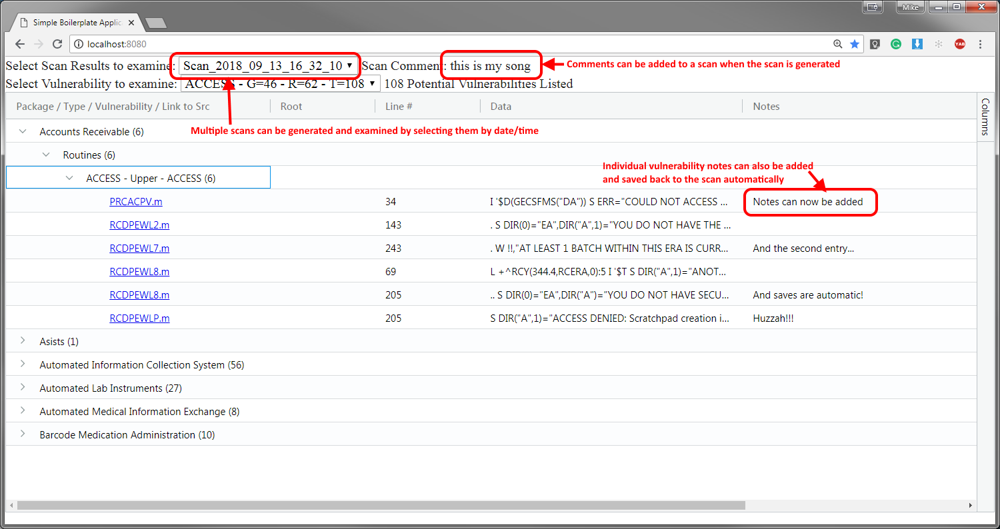

#Vulnerability Scanner

***ToDo:*** Add any new feature requests as an [issue](https://github.com/barlowm/VistA_Vuls/issues) in the git repo

##Prep Software Installation:

Make sure the following software is previously installed on the machine that will be running the code:

Git (version 2.10 or greater)

To check git installation run the following command from a command console:

```
> git --version
```

You should see a result similar to the following:

```
git version 2.10.2.windows.1
```

Node.JS (ver 8.11 or greater)

To check Node.JS installation run the following command from a command console:

```
> node -v
```

You should see a result similar to the following:

```
v8.11.3
```

NPM (ver 6.4 or greater)

To check NPM installation run the following command from a command console:

```
> npm -v
```

You should see a result similar to the following:

```
6.4.1
```

Grep - this is installed as part of the GIT installation, or if running on a linux box it's already installed as a command line tool. To test if grep is installed run the following command from a command console:

```
> grep --v
```

You should see a result similar to the following:

```
grep (GNU grep) 2.26
Copyright (C) 2016 Free Software Foundation, Inc.
License GPLv3+: GNU GPL version 3 or later <http://gnu.org/licenses/gpl.html>.
This is free software: you are free to change and redistribute it.
There is NO WARRANTY, to the extent permitted by law.

Written by Mike Haertel and others, see <http://git.sv.gnu.org/cgit/grep.git/tree/AUTHORS>.
```


## Application Download/Installation

Clone a copy of the git repository into the directory where you will be running the application. 

If using git from the command line prompt use:

```
> git clone https://github.com/barlowm/VistA_Vuls.git
```

You should see something similar to the following:

```
Cloning into 'VistA_Vuls'...
remote: Counting objects: 25, done.
remote: Compressing objects: 100% (18/18), done.
remote: Total 25 (delta 8), reused 24 (delta 7), pack-reused 0
Unpacking objects: 100% (25/25), done.
```

Change to the working directory and install the software:

```
> cd VistA_Vuls
> npm run setup
```

You should see something similar to the following:

```
> planc_vulnerabilities@2.0.0 setup C:\Users\Administrator\Downloads\VistA_Vuls
> npm install npm -g& npm install gulp-cli -g& npm install gulp -g& npm install

C:\npm\npx -> C:\npm\node_modules\npm\bin\npx-cli.js
C:\npm\npm -> C:\npm\node_modules\npm\bin\npm-cli.js

- npm@6.4.1
  updated 1 package in 20.973s
  npm WARN rm not removing C:\npm\gulp.cmd as it wasn't installed by C:\npm\node_modules\gulp-cli
  npm WARN rm not removing C:\npm\gulp as it wasn't installed by C:\npm\node_modules\gulp-cli
  C:\npm\gulp -> C:\npm\node_modules\gulp-cli\bin\gulp.js
- gulp-cli@2.0.1
  updated 1 package in 13.169s
  npm WARN deprecated gulp-util@3.0.8: gulp-util is deprecated - replace it, following the guidelines at https://medium.com/gulpjs/gulp-util-ca3b1f9f9ac5
  npm WARN deprecated graceful-fs@3.0.11: please upgrade to graceful-fs 4 for compatibility with current and future versions
  of Node.js
  npm WARN deprecated minimatch@2.0.10: Please update to minimatch 3.0.2 or higher to avoid a RegExp DoS issue
  npm WARN deprecated minimatch@0.2.14: Please update to minimatch 3.0.2 or higher to avoid a RegExp DoS issue
  npm WARN deprecated graceful-fs@1.2.3: please upgrade to graceful-fs 4 for compatibility with current and future versions of Node.js
  npm WARN rm not removing C:\npm\gulp.cmd as it wasn't installed by C:\npm\node_modules\gulp
  npm WARN rm not removing C:\npm\gulp as it wasn't installed by C:\npm\node_modules\gulp
  C:\npm\gulp -> C:\npm\node_modules\gulp\bin\gulp.js
- gulp@3.9.1
  updated 1 package in 7.878s
  npm WARN planc_vulnerabilities@2.0.0 No description

added 6 packages from 9 contributors and audited 7 packages in 1.027s
found 0 vulnerabilities
```

##Vulnerabilities to scan for

The file containing the list of vulnerabilities to scan for as well as the path to the VistA source code repository to scan is in the "Scan4Vulnerabilities.js" file:

```
const Vulnerability = require("./ListOfVulnerabilities2ScanFor.js");
const scanPath = "../Packages/*";
```

The list of vulnerabilities is an array of JSON objects of the following format:

		{
			"name": "S_At", <-- Name to use for the vulnerability to scan for
			"type": "Upper", <-- The type of vulnerability (still under development)
			"value": "S @", <-- The string to search for (this is a standard RegEx string)
			"options": "" <-- The options to pass to grep (-nr are passed as a minimum)
		}
##Performing a scan

Once configuration is complete to kick off a scan run the following command:

```
> npm run scan
```

You can optionally add a note which will be associated with the scan being performed

```
> npm run scan This is my notation for this particular scan
```

You should see something similar to the following:

```
Scanning VistA for 24 different vulnerabilities
Starting - S_At
Starting - S_Up
Starting - S_UPDARRAY
Starting - D_UPDATE_GMPLUTL
Starting - Reference
Starting - ORQQPL
```

Once the scan is complete you should see a result message showing the total # of potential vulnerabilities identified and the duration of the scan in hh:mm:ss.sss similar to the following:

```
Processed 7240 total vulnerabilities scanned in 00:00:11.797
```

Additional scans can be performed and each set of scan results will be stored in their own folder in the "_ScanResults" folder. Different scans are identified by their own folder with a folder name specifying the scan date/time in the following format:

***Scan_YYYY_MM_DD_HH_MM_SS_S***

##Launching the Web Application

Once scanning is complete you can launch the display application with the following command:

```
> npm run server
```

You should see something similar to the following:

```
Starting up http-server, serving ./
Available on:
  http://10.233.140.127:8081
  http://10.0.0.90:8081
  http://192.168.56.1:8081
  http://192.168.33.1:8081
  http://192.168.60.1:8081
  http://55.55.55.1:8081
  http://10.11.12.1:8081
  http://127.0.0.1:8081
Hit CTRL-C to stop the server
```

You can then open up a web browser to see the web application




